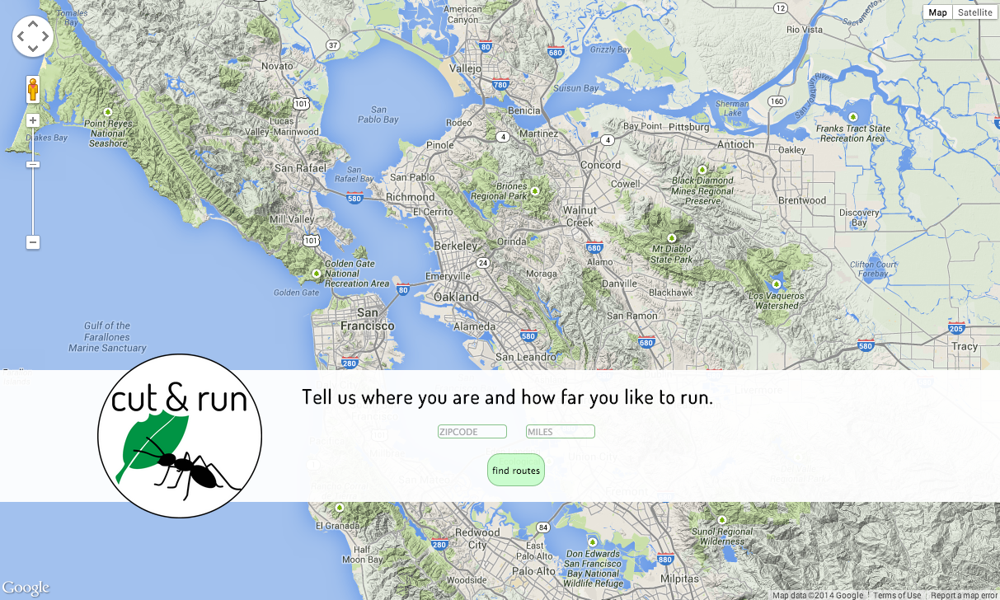
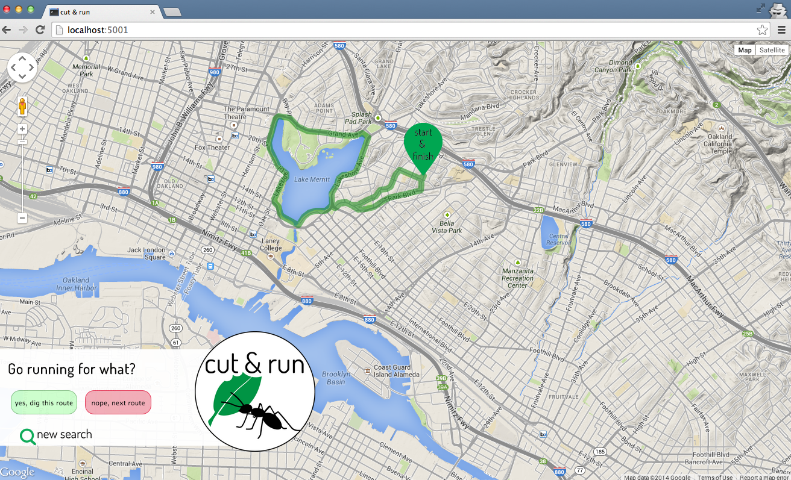
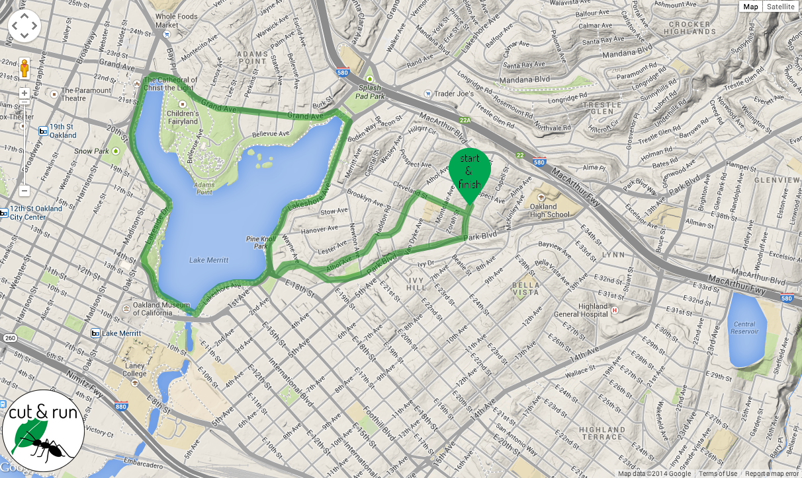
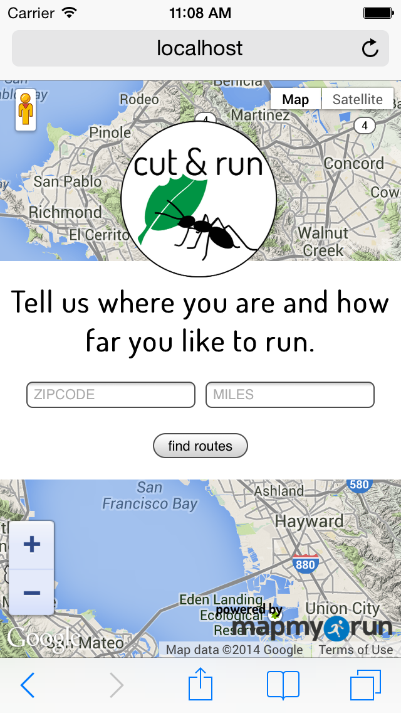

# Cut & Run

A single-page web app to enable users to visually page through local running
route data in a user-friendly interface, built from the premise *like Tinder...for running routes*. 

## Overview

* Basemap from Google Maps JavaScript API v3 
* Route data from MapMyFitness API (over 60 million routes worldwide)
* Route data from each API call stored in Postgres database; database interaction
with SQLAlchemy
* Single-page app built on Python/Flask and Javascript/AJAX

## Dependencies

Available in [requirements.txt](requirements.txt).

## Development

Each MapMyFitness API call (limit: "reasonable request volume") queries by location and distance from an existing collection of over 60 million routes worldwide. Geographical location and distance for the query are set by the user on the starting screen; after which the location is encoded to latitude and longitude by the Google Geocoding API (limit: 2,500 requests per 24 hour period; 10 requests per second.) Distance range used is +/- .5 mile from the user-specified distance.

All routes returned from each API call are commited to a Postgres database to
allow for future route searches to query the database directly.

An additional filter function automatically displays only those routes with start and end points fewer than 500 feet (110 m) apart, accounting for both loops or out-and-back routes while discounting one-way routes that would return the user to a location far from the starting point without including the return milage. 

## Design

The development and design of this application came from an idea on a run (the
general source of all best & worst life ideas). A friend and I were talking
about our general lack of engagement with fitness/fitness tracking apps for
runners (think Strava, MapMyRun) due to uninspriring and unnecessarily complication designs, as well as a general use mindset geared toward a very specific athlete.

Consequently, I designed Cut & Run to be simple, straightforward, user-friendly,
and inclusive way to access and utilitze the huge volumes of availble fitness
data. It is about getting out and actually running, and can be used for
reference in a new city or for cruising new routes in your neighborhood.

Inspired by the swipe-through design of many popular mobile apps, the routes
output by a location/distance search are displayed one at a time, and the user
is able to click through as many or as few as desired. Once a route is chosen
as the preferred route, the excess interface is replaced by only a small logo
and the map zooms to center on the starting point of the route.

Additional highlights of the site design are:

* Single-page app powered by JavaScript to minimize page reloads
* Simple interface with minimal input requirement (location and distance)
* Custom loading screen display during initial API call for routes. All routes
returned from API call are stored in database to minimize future loading times.
* Responsive styling for mobile use

## Screenshots

*Starting screen*

*Initial route screen*

*Route choice screen*

*Mobile starting screen*
![Mobile starting screen]

## Future steps forward

* Full adaptive mobile site with swipe-through capability to move through routes
* User ability to receive routes by e-mail and share route information on social media

