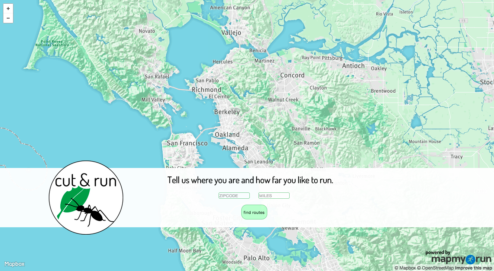
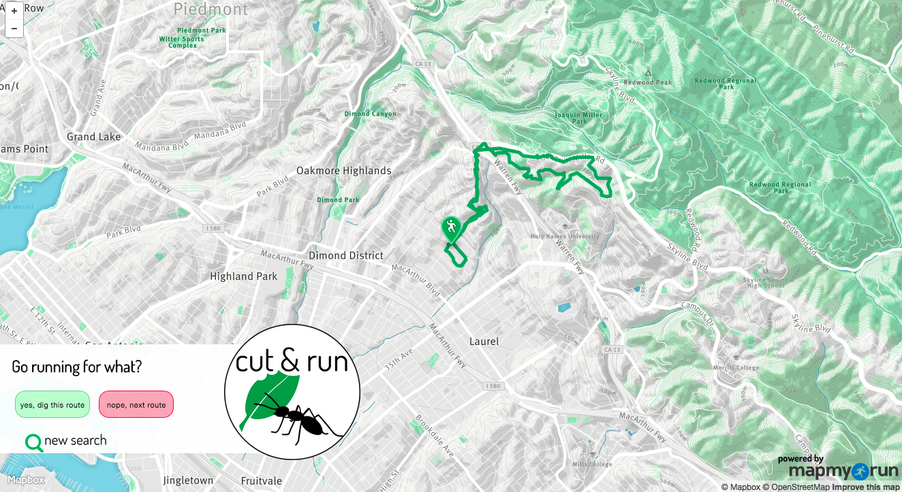
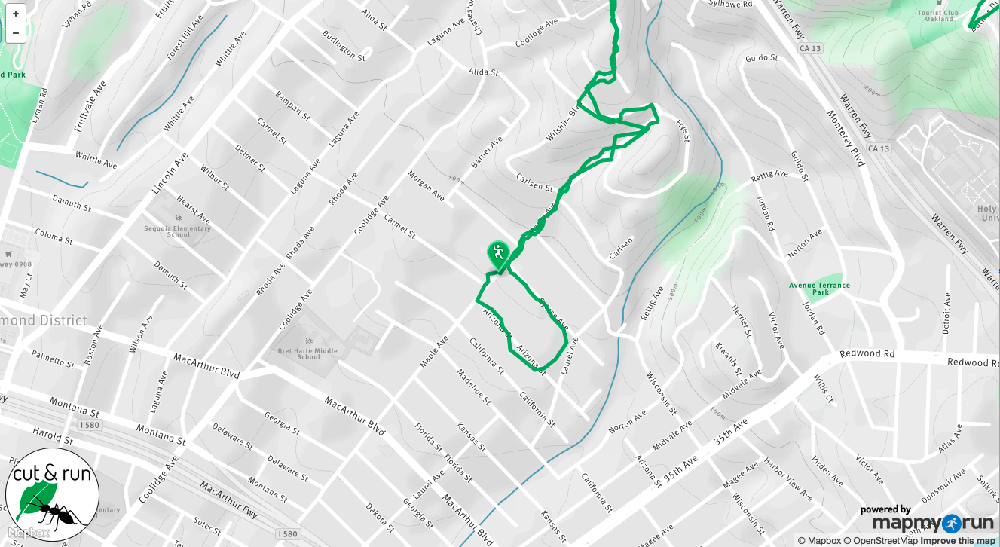

# Cut & Run

A single-page web app to enable users to visually page through local running
route data in a user-friendly interface, built from the premise *like Tinder...for running routes*. 

## Overview

* Single-page app built on Python (Flask framework) and Javascript
* Basemap and other mapping services from Mapbox @ https://www.mapbox.com/developers/api/
* Route data from Under Armour API (formerly MapMyFitness) @ https://developer.underarmour.com/
* [deprecated] Route data from each API call stored in Postgres database; database interaction with SQLAlchemy 

## Dependencies

Available in [requirements.txt](requirements.txt).

## Build & Run instructions (with mac os-friendly notes)

1.	Clone repo
	```
	git clone https://github.com/tesslins/cut_and_run.git --branch mapbox
	cd cut_and_run
	```
2.	Create virtual environment
	```
	virtualenv env
	```
3.	Activate virtual environment
	```
	source env/bin/activate
	```
4. Install dependencies
	```
	pip install -r requirements.txt
	```
5. Register at https://developer.underarmour.com/member/register to get a key and additional access token, secret, etc.

6. Set key as environmental variable.
	```
	export MAPMYAPI_KEY=key (replace key with actual key!)
	```
7. Set secret as environmental variable.
	```
	export MAPMYAPI_SECRET=secret (replace secret with actual secret!)
	```
8. Run oauth2_test.py to generate access token.
	```
	python oauth2_test.py 
	```
9. Add access token to mapmyfitness_oauth2_clientcredentials.
10. Ready to run app.
	```
	python app.py
	```

## Development

Each MapMyFitness API call (limit: "reasonable request volume") queries by location and distance from an existing collection of over 60 million routes worldwide. Zipcode and route distance for the query are entered by the user on the starting screen, after which the location is encoded to a latitude and longitude bounding box by the Mapbox Geocoder API. Distance range used is +/- .5 mile from the user-specified distance.

Additional route processing displays only those routes with start and end points fewer than 110m (360 feet) apart, accounting for both loops or out-and-back routes while skipping over one-way routes that would return the user to a location far from the starting point without including the return milage. 

Routes are displayed as a polyline and the start point is marked with a single marker, set as a geojson from first point in the list.

## Design

The development and design of this application came from an idea on a run (the general source of all best & worst life ideas). A friend and I were talking about our general lack of engagement with fitness/fitness tracking apps for runners (think Strava, MapMyRun) due to uninspriring and unnecessarily complication designs, as well as a general use mindset geared toward a very specific athlete.

Consequently, I designed Cut & Run to be simple, straightforward, user-friendly, and inclusive way to access and utilitze the huge volumes of availble fitness data. It is about getting out and actually running, and can be used for reference in a new city or for cruising new routes in your neighborhood.

Inspired by the swipe-through design of many popular mobile apps, the routes
output by a location/distance search are displayed one at a time, and the user
is able to click through as many or as few as desired. Once a route is chosen
as the preferred route, the excess interface is replaced by only a small logo
and the map zooms to center on the starting point of the route.

Additional highlights of the site design are:

* Single-page app powered by JavaScript to minimize page reloads
* Simple interface with minimal input requirement from the user (location and distance)
* Custom loading screen display during initial API call for routes. All routes
returned from API call are stored in database to minimize future loading times.
* [in progress] Adaptive styling for mobile use 

## Screenshots (screenshots show app with Google Maps API)

*Starting screen*


*Initial route screen*


*Route choice screen*


*Mobile starting screen (using Google Maps)*


## Future steps forward

* Additional map design customization
* Increased error feedback to users
* Full adaptive mobile site with swipe-through capability to move through routes
* Ability to receive routes by e-mail and share route information on social media
* Speed optimization (possibly make API calls in the background?)

