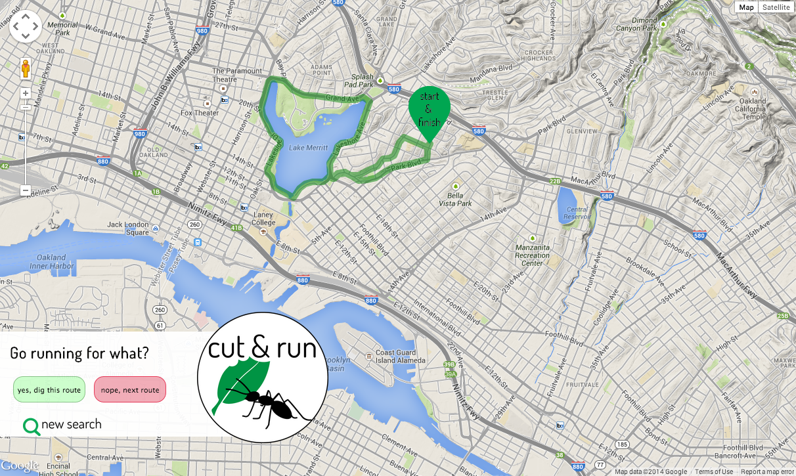

# Cut & Run

A single-page web app to enable users to visually page through local running
routes, built from the premise *like Tinder...for running routes*. 

## Overview

* Basemap from Google Maps JavaScript API v3 
* Route data from MapMyFitness API (over 60 million routes worldwide)
* Route data from each API call stored in SQLite database; database interaction
with SQLAlchemy
* Single-page app built on Python/Flask and Javascript/AJAX

## Development

The development and design of this application came from an idea on a run (the
general source of all best & worst life ideas) - my friend and I were talking
about our general lack of engagement with fitness/fitness tracking apps for
runners (think Strava, MapMyRun) due to uninspriring designs and a general
use mindset gendered toward competitive male athletes.

## Design

I designed Cut & Run to be simple, straightforward, user-friendly, and inclusive.
It is about getting out and actually running, and can be used for reference in
a new city or for cruising new routes in your neighborhood.

Some highlights of the site design are:

* Single-page app powered by JavaScript to minimize page reloads
* Simple interface with minimal input requirement (location and distance)
* Custom loading screen display during initial API call for routes. All routes
returned from API call are stored in database to minimize future loading times.
* Responsive styling

## Screenshots

*Starting screen*

*Route display screen*

## Future steps forward

* Full adaptive mobile site with swipe-through capability to move through routes
* Move to PostGreSQL database (includes PostGIS for storing spatial data)

